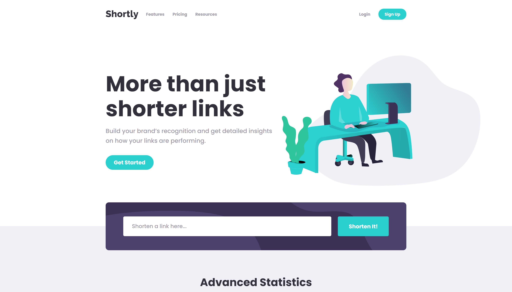

# Frontend Mentor - Shortly URL shortening API Challenge solution

This is a solution to the [Shortly URL shortening API Challenge challenge on Frontend Mentor](https://www.frontendmentor.io/challenges/url-shortening-api-landing-page-2ce3ob-G). Frontend Mentor challenges help you improve your coding skills by building realistic projects.

## Table of contents

- [Overview](#overview)
  - [The challenge](#the-challenge)
  - [Screenshot](#screenshot)
  - [Links](#links)
- [My process](#my-process)
  - [Built with](#built-with)
  - [What I learned](#what-i-learned)
  - [Continued development](#continued-development)
  - [Useful resources](#useful-resources)
- [Author](#author)
- [Acknowledgments](#acknowledgments)

## Overview

### The challenge

Users should be able to:

- View the optimal layout for the site depending on their device's screen size
- Shorten any valid URL
- See a list of their shortened links, even after refreshing the browser
- Copy the shortened link to their clipboard in a single click
- Receive an error message when the `form` is submitted if:
  - The `input` field is empty

### Screenshot

### Links

- [Live Site Preview](https://mieszkokowalik.github.io/url-shortening-api-master/)

## My process

### Built with

- Semantic HTML5 markup
- SCSS
- BEM methodology
- Mobile-first workflow
- Flexbox
- Grid
- JavaScript
- Intersection Observer API
- Clipboard API
- Shrtcode API

### What I learned

This was my first more complex project with SCSS. Building the structure with a 7-1 pattern really helped with any code modyfications. In a future I would like to further explore possibilities of SCSS to write more maintainable and DRY code.

This challange was great for practicing fetching and handling data from 3rd party API.

### Useful resources

- [shrtcode API documentation](https://shrtco.de/docs/)
- [Kevin Powell - Intersection Observer JS API](https://www.youtube.com/watch?v=T8EYosX4NOo&ab_channel=KevinPowell/)
- [MDN - Intersection Observer API documentation](https://developer.mozilla.org/en-US/docs/Web/API/Intersection_Observer_API)
- [MDN - Clipboard API](https://developer.mozilla.org/en-US/docs/Web/API/Clipboard_API)
- [w3.org WAI-ARIA documentation](https://www.w3.org/TR/wai-aria-practices-1.1/?fbclid=IwAR1wN3ZzDP4Fzy6uaYRdQiYYfaXtac2vfyA58KMBnFwWW69R0oaEvPMLQvc#disclosure)
- [SASS - File Architecture](https://sass-guidelin.es/#architecture)

## Author

- Frontend Mentor - [@MieszkoKowalik](https://www.frontendmentor.io/profile/MieszkoKowalik)
